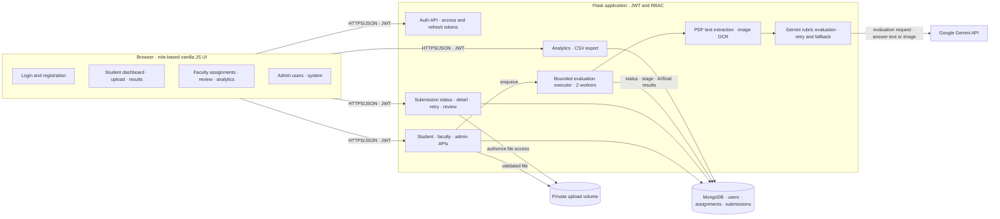

# Auto Grade AI

Auto Grade AI evaluates student answer scripts using a Flask API, MongoDB, JWT role-based access, a vanilla JavaScript interface, OCR/text extraction, and Google Gemini. Evaluation runs in a bounded in-process thread pool. MongoDB stores each job's status and stage so queued/interrupted work can be picked up on app restart. Faculty review preserves the original AI result and writes edits into a separate final result.

## Runtime architecture



The browser never receives model answers from student routes. Uploaded files are random-named, validated, and served only to the submission owner, owning faculty, or an admin.

## Local setup (Windows PowerShell)

Requirements: Python 3.12 (3.11+ should work), Node is only needed for frontend checks, MongoDB 7+ running locally or an Atlas URI, and a Gemini API key for live grading.

```powershell
py -3.12 -m venv .venv
.\.venv\Scripts\Activate.ps1
python -m pip install -r backend\requirements-dev.txt
Copy-Item .env.example .env
```

Edit `.env`: set `MONGO_URI`, a long random `JWT_SECRET_KEY`, and `GEMINI_API_KEY`. Start local MongoDB, then run:

```powershell
$env:PYTHONPATH = "backend"
python backend\app.py
```

Open [http://localhost:5000](http://localhost:5000). For a seeded local admin/faculty/student set, inspect `backend/seed.py` before running it.

## Docker

Copy `.env.example` to `.env`, set `JWT_SECRET_KEY` and `GEMINI_API_KEY`, then run:

```powershell
docker compose up --build
```

The app is available at [http://localhost:5000](http://localhost:5000). Compose starts only the Flask app and MongoDB; uploads and database files use named volumes.

## Configuration

| Variable | Purpose | Default |
|---|---|---|
| `MONGO_URI` | MongoDB connection | `mongodb://localhost:27017/` |
| `MONGO_DB_NAME` | Database name | `answer_evaluation_system` |
| `JWT_SECRET_KEY` | Signs access and refresh JWTs | development placeholder; replace it |
| `JWT_ACCESS_TOKEN_EXPIRES` | Access token lifetime in seconds | `1800` |
| `JWT_REFRESH_TOKEN_EXPIRES` | Refresh token lifetime in seconds | `2592000` |
| `GEMINI_API_KEY` | Google Gemini credential | unset |
| `GEMINI_MODEL` | Primary model | `gemini-flash-lite-latest` |
| `GEMINI_FALLBACK_MODEL` | Fallback model | `gemini-2.0-flash-lite` |
| `GEMINI_TIMEOUT_SECONDS` | Per request timeout | `60` |
| `EVALUATION_WORKERS` | In-process evaluation workers | `2` |
| `MAX_CONTENT_LENGTH` | Maximum upload bytes | `10485760` (10 MB) |
| `UPLOAD_FOLDER` | Private upload directory | `backend/uploads` |

## APIs

Existing `/api/auth`, `/api/student`, `/api/faculty`, and `/api/admin` routes remain available. Added routes include:

- `POST /api/auth/refresh`
- `GET /api/submissions/<id>` and `GET /api/submissions/<id>/status`
- `POST /api/submissions/<id>/retry` and `PUT /api/submissions/<id>/review`
- `GET /api/assignments/<id>/analytics` and `GET /api/assignments/<id>/export.csv`
- `POST /api/admin/retry-failed`

Submission and admin lists accept `page`, `page_size`, `status`, and `assignment_id` where applicable. Access tokens last 30 minutes; the browser rotates them using the refresh endpoint.

## Data migration

Back up MongoDB first, then run from the repository root with `.env` configured:

```powershell
$env:PYTHONPATH = "backend"
python backend\migrations\backfill_submission_results.py
```

The script backfills `ai_result`, `final_result`, and normalized job statuses for old submission documents.

## Tests

```powershell
.\.venv\Scripts\Activate.ps1
pytest -q
```

The tests use an isolated in-memory MongoDB mock and do not call Gemini. GitHub Actions runs the same suite on pushes and pull requests.
